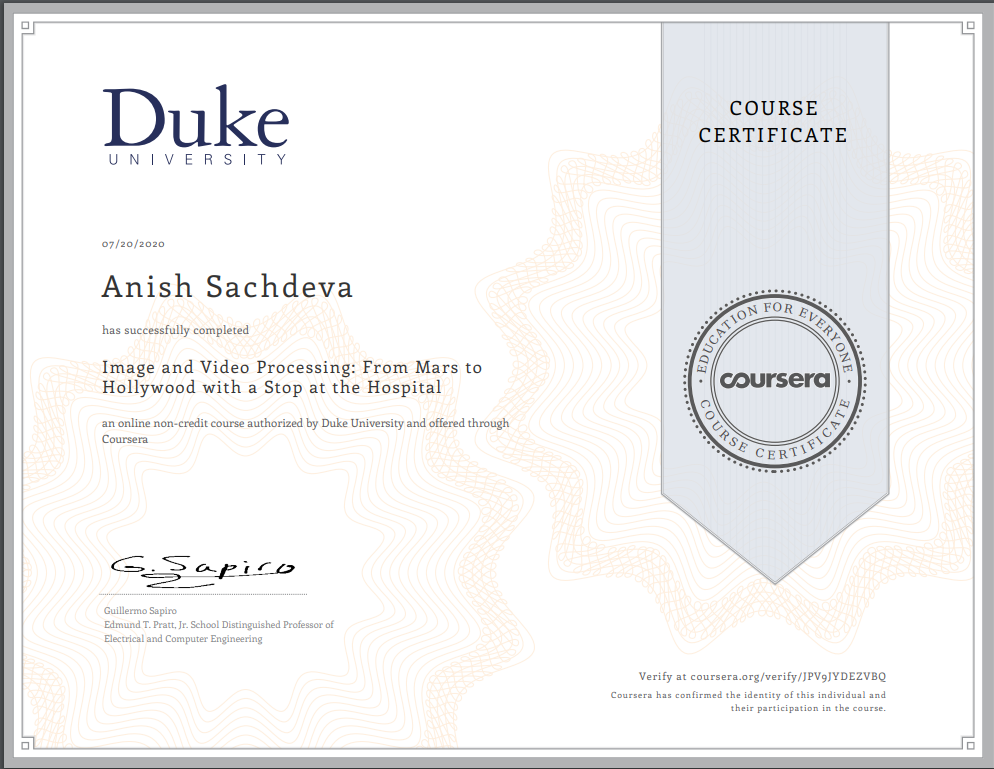

# Image and Video Processing: From Mars To Hollywood with a Stop at The Hospital
__By Duke University__

## 📖 Overview
- [Week 1](#week-1)
- [Week 2](#week-2)
- [Week 3](#week-3)
- [Week 4](#week-4)
- [Week 5](#week-5)
- [Week 6](#week-6)
- [Week 7](#week-7)
- [Week 8](#week-8)
- [Certificate](#-certificate)

## Week 1
### Quizzes
- [Quiz #1](week-1/quiz-1.md)

### Programming Assignments (Optional)
- [Reduce Number of Intensity Levels in an image](week-1/reducePixelIntensityLevels.m)
- [Perform Sample Spatial Average](week-1/spatialAverage.m)
- [Rotate Image](week-1/rotateImage.m)
- [Reduce Spatial Resolution by Taking Average](week-1/reduceImageSpatialResolution.m)

## Week 2
### Quizzes
- [Quiz #2](week-2/quiz-2.md)

### Programming Assignments (Optional)
- [DCT Implementation](week-2/dctTest.m)
- [Channel Separation of an Image into RGB](week-2/test.m)

## Week 3
### Quizzes
- [Quiz #3](week-3/quiz-3.md)

### Programming Assignments (Optional)
- [Exponential Transform](week-3/exponentialTransform.m)
- [log Transform](week-3/logTransform.m)
- [Intensity Range Transform](week-3/intensityRangeTransformation.m)
- [Inverse Transform point Operations](week-3/inverseTransformPointOperation.m)
- [Thresholding Point Operation](week-3/thresholdingPointOperation.m)
- [Histogram Equalization](week-3/histogramEqualization.m)
- [Histogram Matching](week-3/histogramMatching.m)
- [Median Filtering](week-3/median_filtering.m)
- [Unsharp Operation](week-3/unsharp_operation.m)

## Week 4
### Quizzes
- [Quiz #4](week-4/quiz-4.md)

### Programming Assignments (Optional)
- [Types of Noise](week-4/noise_in_images.m)
- [Wiener Filtering on grayscale Image](week-4/weiner_filter.m)
- [Wiener Filtering on Color Images](week-4/wiener_3d.m)

## Week 5
### Quizzes
- [Quiz 5](week-5/quiz-5.md)

### Programming Assignments (Optional)
- [Perform Hough Transform to Detect Straight Lines in Image](week-5/hough_transform.m)
- [Thresholding with Otsu's Method](week-5/otsu_thresholding_method.m)

## Week 6
### Quizzes
- [Quiz 6](week-6/quiz-6.md)

## Week 7
### Quizzes
- [Quiz 7](week-7/quiz-7.md)

## Week 8
### Quizzes
- [Quiz 8](week-8/quiz-8.md)

## 🎓 [Certificate](https://www.coursera.org/verify/JPV9JYDEZVBQ)

